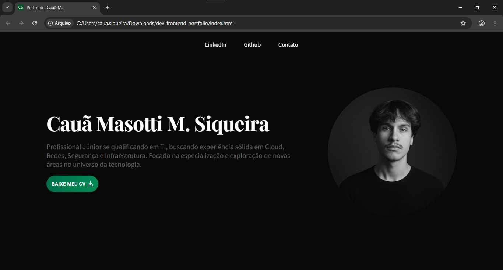
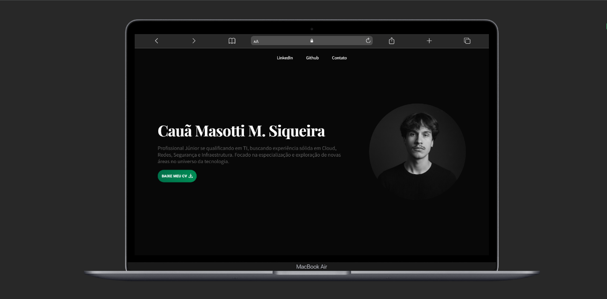
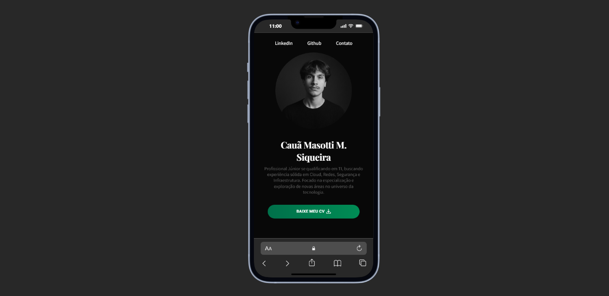
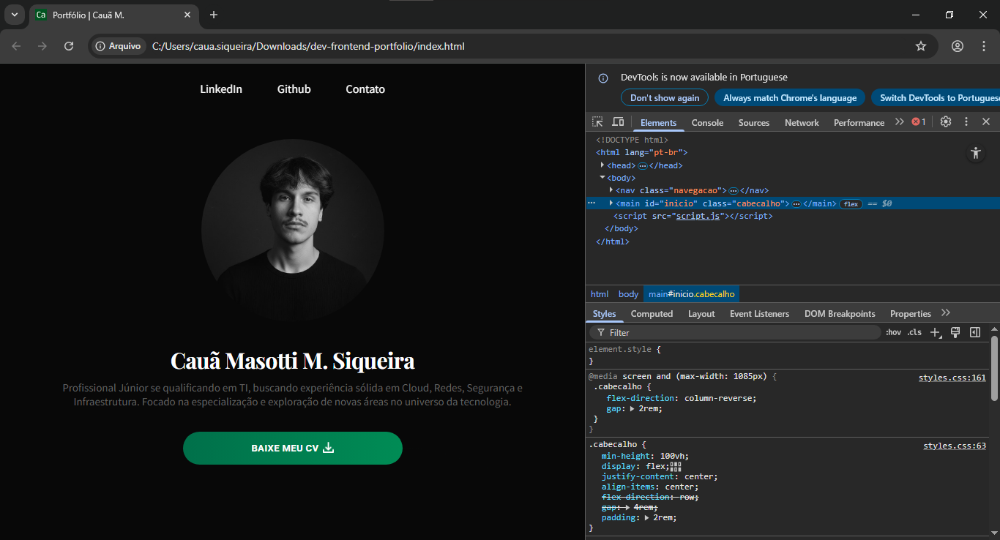

#  **Portfólio Pessoal — HTML & CSS (ESTUDANDO PARA FAZER DEPLOY AWS)** ☁️

O projeto de portfólio pessoal foi desenvolvido em **HTML + CSS**, com foco em um **estrutura limpa e visual profissional**.
O objetivo principal é registrar meus conhecimentos práticos para preenhcer meu perfil.

 

**Estrutura e Planejamento**

A ideia do projeto começou como uma forma de demonstrar minhas habilidades em AWS, Infraestrutura e Gestão de Projetos.  
Durante o processo, optei por criar toda a aplicação focando no meu perfil e no meu estilo, simulando um planejamento da criação de uma startup: planejamento, desenvolvimento, segurança, estrutura de redes e deploy.

O propósito é realizar o deploy em ambiente de nuvem (AWS) e construir uma infraestrutura segura com o funcionamento no ar. Vejo que esse modelo montado pode me trazer uma simulação de conhecimento.

 

> 💡 Este projeto serve como uma prova sólida para mostrar minhas capacidades técnicas e da importância de práticar e colocar os ensinamentos em dia.

 

**Tecnologias Utilizadas**

| Categoria | Ferramenta / Tecnologia |
|------------|--------------------------|
| **Linguagens** | HTML5, CSS3 |
| **Estilo** | CSS Flexbox, Design Responsivo, Animação e efeitos |
| **Planejamento Futuro** | Aplicações de Segurança e Redes |
| **Infraestrutura (Deploy Futuro)** | AWS |
| **Controle de Versão** | Git + GitHub |
| **Editor de Código** | Visual Studio Code |

 

⏩ **Sigam as imagens e link do projeto em diferentes dispositivos:**

 

⏩ Link: https://cauamasotti.github.io/dev-frontend-portfolio

 

Agradeço a todos que viram até aqui.  
Abaixo deixo meus contatos para quem quiser trocar uma ideia ou colaborar em novos projetos.

Desenvolvido por: 
**Cauã Masotti M. Siqueira**   

**Conecte-se comigo:**  
- 🌐 [LinkedIn](https://www.linkedin.com/in/cauamasotti)  
- 💻 [GitHub](https://github.com/cauamasotti)  
- ✉️ **E-mail:** masotticaua@gmail.com

